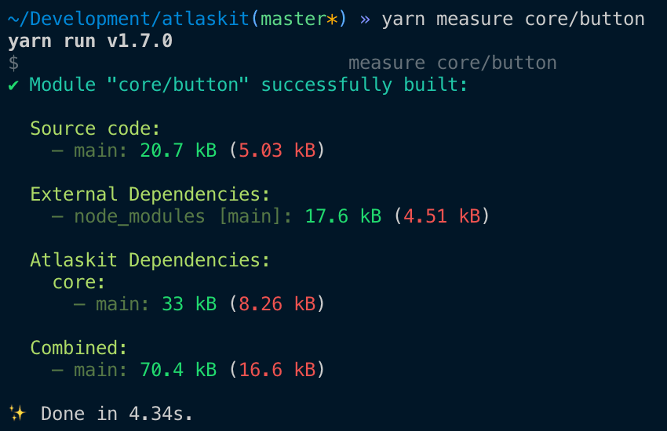

# Atlaskit Measure Tool

The atlaskit measure tool is effectively a quick script to analyze the webpack bundle for a package. This is incredibly useful both to get the bundle size at-a-glance as well as when doing deep dives into bundle size.

There are two commands in measure:

## Basic usage

```sh
yarn measure [path1] [path2] [path3]
```

For example, to measure button, you would use:

```sh
yarn measure core/button
```

This prints output just to the terminal which will look like:



As you can see, we have split our code into different chunks to better understand where weight is. Most importantly, you can see if atlaskit, the code's own source, or external dependencies are the things weighing the package down.

## In-depth analysis

Sometime you will need to look into what is in each chunk. To do this, you can add the `--analyze` flag.

```sh
yarn measure [path] --analyze
```

This will output the information above to the console, but will also launch a new tab in your browser which shows the [webpack-bundle-analyzer](https://www.npmjs.com/package/webpack-bundle-analyzer) view of the code.

With this, you can see exactly what packages or files are heavy.

## Exceptions

It is important to know that we filter out some 'common packages' that are a cost that will be paid by almost everyone using atlaskit. Including these common packages in each output would distort information.

The excluded packages are:

- `react` 5.9kb (2.5kb)
- `react-dom` 96.5kb (30.9kb)
- `styled-components` 43.1kb (16kb)
- `tslib` 5.6kb (2kb)
- `prop-types` 829B (502B)

## A note on this package

The way this package is currently written it is **heavily** tied to the Atlaskit code-base. If you wish to use it elsewhere, we strongly recommend making sure you understand why each piece of the code exists when rolling your own version.